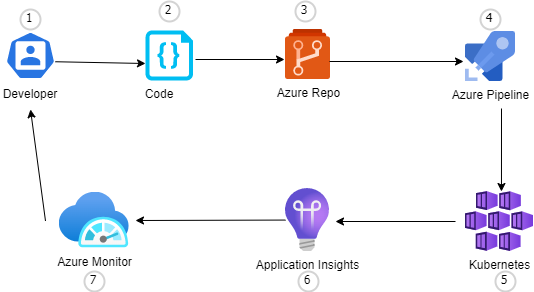

# DevOps-Journey-Using-Azure-DevOps

Welcome to your comprehensive guide through a DevOps journey using Azure DevOps! This tutorial will walk you through the entire process, from setting up your pipeline to deploying an application on your Azure Kubernetes cluster.

# What you will learn

In this tutorial, you will gain hands-on experience in the following areas:
- **Azure DevOps Setup**: Learn how to set up Azure DevOps to begin deploying to Azure using Pipelines as code.
- **Terraform Deployment**: Discover how to deploy Azure resources using Terraform modules for efficient infrastructure management.
- **Application Deployment**: Deploy a test application to Azure Kubernetes Service (AKS) and understand the deployment process.
- **CI/CD Fundamentals**: Grasp the concepts of Continuous Integration and Continuous Deployment (CI/CD) with automated application deployments.
- **Automated Testing**: Implement automated testing to validate your deployed Azure resources.
- **Monitoring and Alerting**: Explore monitoring and alerting solutions using Application Insights and Container Insights to keep track of your application's health and performance.

This setup is designed to reflect a real-world scenario, providing you with practical, applicable skills.

## Tutorial/labs format

Before you begin, please ensure you have reviewed the [prerequisites](https://github.com/thomast1906/DevOps-Journey-Using-Azure-DevOps/blob/main/prerequisites.md). This step is crucial to ensure you have all necessary tools and configurations in place.

The labs are organised sequentially. You can find them [here](https://github.com/thomast1906/DevOps-Journey-Using-Azure-DevOps/tree/main/labs). Please complete each lab in order: 1, 2, 3, etc.

By following this structured approach, you will build a strong foundation in DevOps practices using Azure DevOps. This journey is not only about learning but also about applying your knowledge to real-life scenarios. Enjoy your DevOps journey!

### Lab Sequence

1. [Initial Setup](https://github.com/thomast1906/DevOps-Journey-Using-Azure-DevOps/tree/main/labs/1-Initial-Setup) starts you off with setting up:
   - [Azure DevOps Setup](https://github.com/thomast1906/DevOps-Journey-Using-Azure-DevOps/blob/main/labs/1-Initial-Setup/1-Azure-DevOps-Setup.md)
     - Create an Azure DevOps organisation
     - Create a new Azure DevOps project
     - Create an Azure Service Principal

   - [Azure Terraform setup](https://github.com/thomast1906/DevOps-Journey-Using-Azure-DevOps/blob/main/labs/1-Initial-Setup/2-Azure-Terraform-Remote-Storage.md)
     - Create a Blob Storage location for the Terraform state file

   - [Create Azure AD Group for AKS Admins](https://github.com/thomast1906/DevOps-Journey-Using-Azure-DevOps/blob/main/labs/1-Initial-Setup/3-Create-Azure-AD-AKS-Admins.md)
     - Create an Azure AD group for AKS administrators

2. [Setup Azure DevOps Pipeline](https://github.com/thomast1906/DevOps-Journey-Using-Azure-DevOps/tree/main/labs/2-AzureDevOps-Terraform-Pipeline) The purpose of this lab is to create all of the Azure cloud services you'll need from an environment/infrastructure perspective to run the test application.
   - [Pipeline setup](https://github.com/thomast1906/DevOps-Journey-Using-Azure-DevOps/blob/main/labs/2-AzureDevOps-Terraform-Pipeline/1-Setup-AzureDevOps-Pipeline.md)
     - Configure the Azure DevOps pipeline to create necessary Azure cloud services for your environment

3. [Deploy Application to Azure Container Registry](https://github.com/thomast1906/DevOps-Journey-Using-Azure-DevOps/tree/main/labs/3-Deploy-App-to-ACR) Deploy sample Application to Container Registry.
   - [Deploy Application to Azure Container Registry](https://github.com/thomast1906/DevOps-Journey-Using-Azure-DevOps/blob/main/labs/3-Deploy-App-to-ACR/1-Deploy-App-to-ACR.md)
     - Build the Docker image locally
     - Run the Docker image locally
     - Deploy the sample application to the Azure Container Registry

4. [Deploy Application to Azure Kubernetes Cluster](https://github.com/thomast1906/DevOps-Journey-Using-Azure-DevOps/tree/main/labs/4-Deploy-App-AKS) 
   - [Add AKS ACR Role assignment](https://github.com/thomast1906/DevOps-Journey-Using-Azure-DevOps/blob/main/labs/4-Deploy-App-AKS/1-Add-AKS-ACR-Role-Assignment.md)
     - Use Terraform to assign roles for AKS managed identity to access the Azure Container Registry

   - [Add Application Insights to Terraform](https://github.com/thomast1906/DevOps-Journey-Using-Azure-DevOps/blob/main/labs/4-Deploy-App-AKS/2-Add-Application-Insights.md)
     - Integrate Application Insights for monitoring the application

   - [Add Azure Key Vault to Terraform](https://github.com/thomast1906/DevOps-Journey-Using-Azure-DevOps/blob/main/labs/4-Deploy-App-AKS/3-Add-KeyVault-to-Terraform.md)
     - Use Azure Key Vault to store secrets in your Azure DevOps Variable Group

   - [Update Pipeline to Deploy Application to AKS](https://github.com/thomast1906/DevOps-Journey-Using-Azure-DevOps/blob/main/labs/4-Deploy-App-AKS/4-Update-Pipeline-Deploy-App-AKS.md)
     - Update the pipeline to deploy the application to AKS

5. [Introduce CI/CD](https://github.com/thomast1906/DevOps-Journey-Using-Azure-DevOps/tree/main/labs/5-CICD) 
   - [Introducing CI/CD to your pipeline](https://github.com/thomast1906/DevOps-Journey-Using-Azure-DevOps/blob/main/labs/5-CICD/1-Introduce-CI-CD-to-your-Pipeline.md)
     - Configure pipeline triggers for automatic runs

   - [Automated deployment of your AKS Application](https://github.com/thomast1906/DevOps-Journey-Using-Azure-DevOps/blob/main/labs/5-CICD/2-Automated-Deployment-AKS-Application.md)
     - Automate the application deployment process to AKS, ensuring updates each time the pipeline runs

6. [Monitoring and Alerting](https://github.com/thomast1906/DevOps-Journey-Using-Azure-DevOps/tree/main/labs/6-Monitoring-and-Alerting) 
   - [Azure Application Insights](https://github.com/thomast1906/DevOps-Journey-Using-Azure-DevOps/blob/main/labs/6-Monitoring-and-Alerting/1-Application-Insights.md)
     - Use Application Insights to view telemetry data

   - [Azure Application Insights Availability Tests](https://github.com/thomast1906/DevOps-Journey-Using-Azure-DevOps/blob/main/labs/6-Monitoring-and-Alerting/2-Application-Insights-Configure-Availability-Test.md)
     - Configure availability tests using Application Insights

   - [Log Analytics Container Insights](https://github.com/thomast1906/DevOps-Journey-Using-Azure-DevOps/blob/main/labs/6-Monitoring-and-Alerting/3-Log-Analytics-Container-Insights.md)
     - Review Log Analytics Container Insights

# CI/CD

Learn how to set up and configure a pipeline that incorporates CI/CD practices:

1. Developer changes application source code.
2. Application is committed to the source code repository in Azure Repos.
3. Continuous integration triggers an application build.
4. Continuous deployment within Azure Pipelines triggers an automated deployment with environment-specific configuration values.
5. Updated application is deployed to an environment-specific Kubernetes cluster.
6. Application Insights collects and analyzes health, performance, and usage data.
7. Azure Monitor collects and analyzes health, performance, and usage data.

# Thank you
Thank you for participating in this tutorial/labs. Your feedback is valuable!

Connect with me on social media:

Feel free to check out my blog for more awesome content!
https://thomasthornton.cloud/ 

Ensure to follow me on GitHub. Please star/share this repository!

